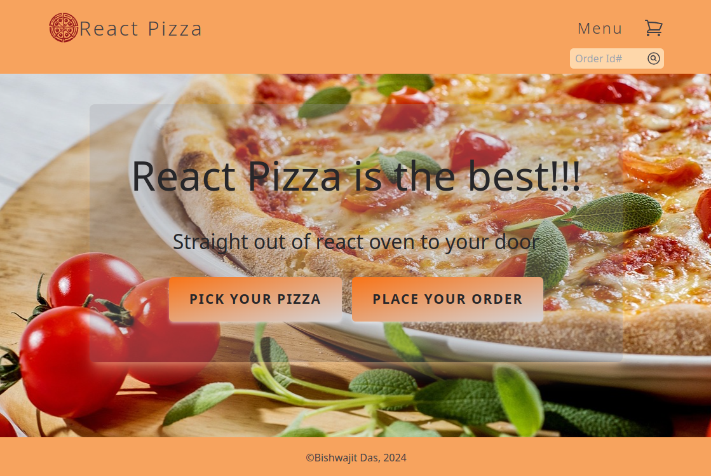
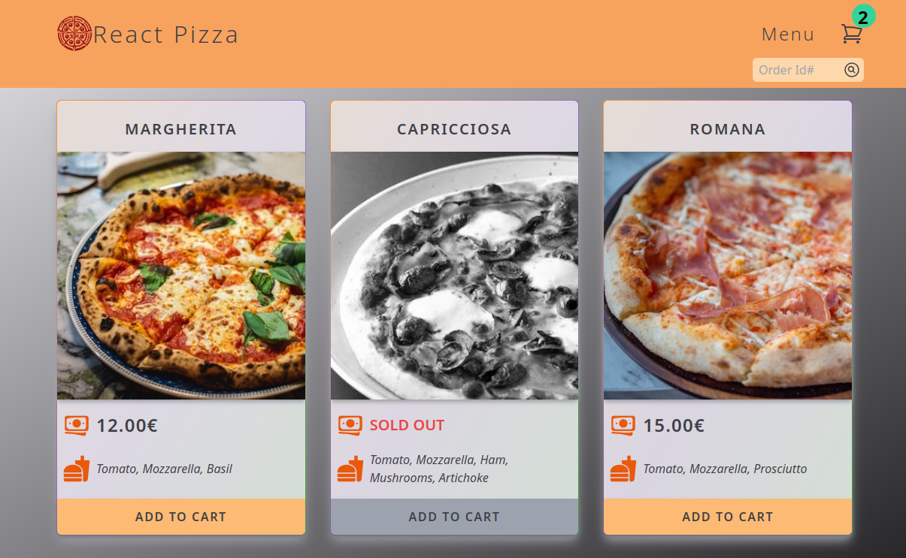
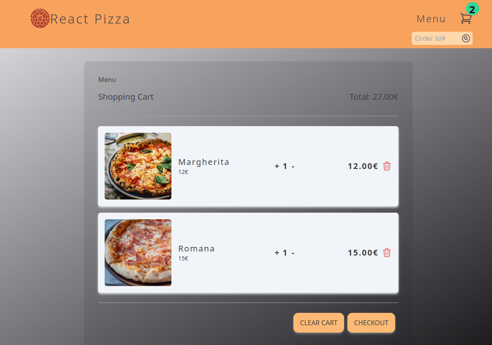
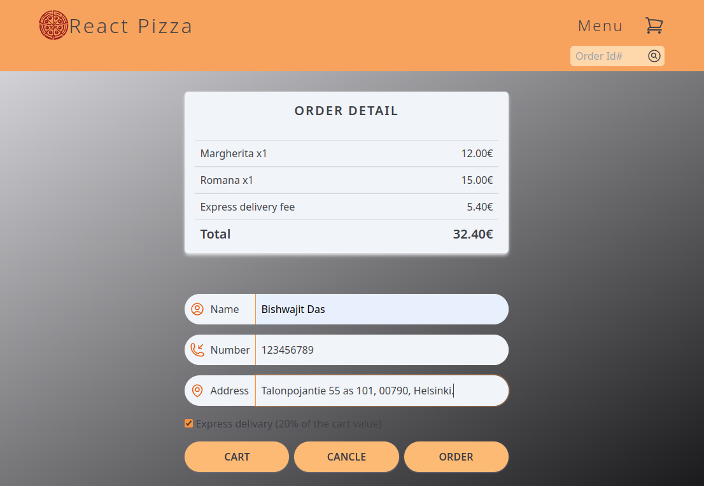
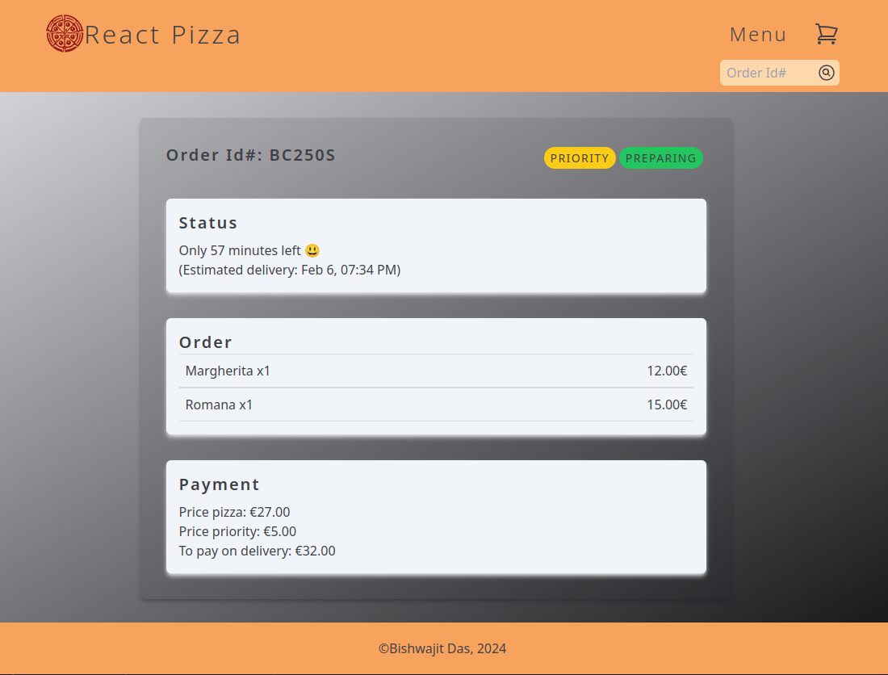

# React Pizzas

## Description

A website for ordering pizzas. Users can add pizzas to the cart and adjust item numbers from the cart. Finally, place an order. After placing an order, users will be redirected to the order status page. I have used "react-fast-pizza-api" API for backend functionalities. The app is hosted at Vercel.

## Live website

<a href="https://react-pizzas-bisso.vercel.app/" target="_blanck">https://react-pizzas-bisso.vercel.app/</a>

## Technologies

- React
- React Router v6.4
- Redux
- Redux Toolkit
- Vite
- TypeScript
- Tailwind CSS

## Author

Bishwajit Das (Bisso)

## Screenshots

### Home page

### Menu page

### Cart

### Order page

### Order status

